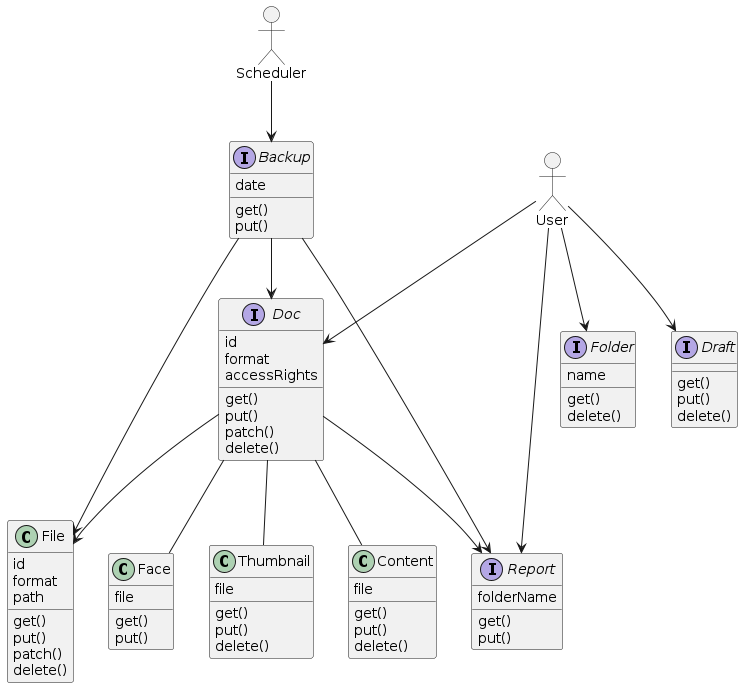

# Archie Design Documents

Archie is a web-based digital archive application designed to preserve the history of small communities. It manages **Digital Assets** (files) and **Catalog Metadata** (Solr documents), providing a unified interface for physical and digital artifacts.

---

## Architectural Principles (RESTful Mindset)
Archie treats every entity as a **Resource**. 
* **Actions** (like extracting text or backing up) are modeled as **State Transitions** or **Sub-resources**.
* **Internal Services** act as specialized workers for specific resource components (Thumbnails, Content).

---

## Service Catalog

### External Services (Public-Facing API)

| Resource | Description | RESTful Mapping |
| :--- | :--- | :--- |
| **Documents** (`/docs`) | The primary unit of the archive. Represents the union of metadata and the physical/digital asset. | `POST` triggers the ingestion pipeline (validation, extraction, thumbnailing). |
| **Folders** (`/folders`) | Represents "Staging Areas" for batch imports. | `GET` lists ready-to-import batches; `DELETE` purges a staging area. |
| **Drafts** (`/drafts`) | Unprocessed items from external channels (e.g., email). | `POST` creates a draft; `DELETE` discards it; Successful drafts are promoted to `/docs`. |
| **Backups** (`/backups`) | Snapshot resources of the archive stored in AWS S3. | `POST` creates a new backup instance; `GET` retrieves backup history and status. |
| **Reports** (`/reports`) | Analytical views of system operations (Ingestion logs, Backup integrity). | `GET` retrieves system health and audit trails. |

### Internal Services (Resource Components)

These services are consumed by the External API to enrich the Document resource.

* **Files (`/files`)**: Manages the persistence layer in S3. Resources are segmented by access level: `public`, `private`, or `secret`.
* **Thumbnails (`/thumbnails`)**: Manages low-resolution visual proxies. `PUT` creates or refreshes the thumbnail resource for a specific asset.
* **Content (`/content`)**: Manages extracted intelligence (OCR text, audio transcripts). `PUT` triggers a new extraction/transcription job.
* **Faces (`/faces`)**: Manages biometric metadata identified within visual assets.

---

## Code Repositories Naming Conventions

We use a flat organizational structure in GitHub with strict naming conventions to simulate architectural grouping:

* **`*-gui`**: User facing webapps (e.g., `admin-gui`).
* **`*-service`**: Implementation of a RESTful endpoint (e.g., `docs-service`).
* **`*-lib`**: Shared logic and utilities (e.g., `image-manipulation-lib`).
* **`infrastructure`**: Infrastructure as Code (Terraform/CDK) and deployment logic.
* **`design`**: Documentation, diagrams, and architectural decision records (ADRs).

---

## System Diagram

